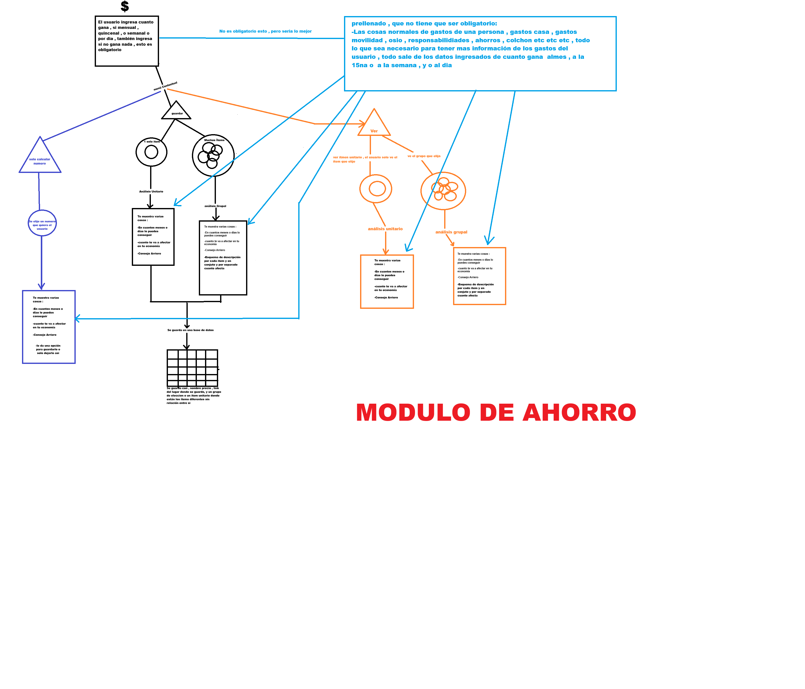

# Módulo de Ahorro — rediseño

**Estado:** especificación acordada. **Fase 1 hecha** (el terreno quedó
limpio); las fases 2, 3 y 4 sin empezar.
**Fecha:** 1 de septiembre de 2026. Última actualización: 2 de septiembre.
**Autor del diseño:** David Salazar (diagrama hecho a mano, aquí abajo).

Este documento reemplaza lo que hoy hace la vista de Ahorro. Cuando el código y
este documento no coincidan, **manda este documento**.

El orden en que se va a construir está en **[PLAN.md](PLAN.md)**: cuatro fases,
cada una con la prueba que hay que hacer al final. **La Fase 1 (borrar) está
hecha**, y ahí quedó anotado lo que apareció al hacerla. La siguiente es la
Fase 2: el menú contextual y la base de datos.

**Condición del proyecto:** David es el único que usa la app y todavía no está
publicada en ninguna parte. Por eso no hay que trasladar datos viejos, ni
mantener compatibilidad con nada, ni avisarle a nadie: **se puede romper con
confianza.**



---

## 1. La regla que manda sobre todas

> **MUY MUY SIMPLE.** Que una persona mayor lo pueda usar sola y entienda bien
> lo que le sale. Desde un bebé hasta un abuelo.

Para lograrlo la app **no inventa metáforas nuevas**: se apoya en las dos cosas
que la gente ya domina de toda la vida.

| Se apoya en | Para qué sirve aquí |
|---|---|
| **La calculadora** | El gesto de escribir un número. Todo el mundo sabe usar una. |
| **La factura de tienda** | La respuesta. Todo el mundo ha recibido un recibo y sabe leerlo. |

Y una sola cosa es obligatoria: **cuánto gana**. Todo lo demás es opcional. Con
eso solo, la app ya responde.

---

## 2. Qué se borra

El módulo de Ahorro queda **casi vacío** y se construye de nuevo desde el
diagrama. Muere todo lo que hoy existe alrededor de la calculadora.

| Se borra | Qué era | Qué se rescata |
|---|---|---|
| `src/metas.js` | La vista de Ahorro actual: la vista sencilla por pasos, la hoja de Excel y la economía tecleada a mano | Las frases del arriero y la barra de progreso, que renacen dentro del recibo |
| `src/sobres.js` | Los sobres del arriero (repartir el ingreso por categorías) | La **idea** del ingreso + frecuencia + categorías de gasto, que renace como el prellenado del punto 3 |
| La cinta y el guardado de `src/calculadora.js` | Los renglones apuntados, el reparto en sobres, el historial de ciclos | Nada |
| El HTML y el CSS de todo lo anterior | `#metas`, `#panel-metas`, `#metas-sencilla`, `#metas-hoja`, la rejilla de sobres | Nada |

### La calculadora es el caso especial

**El botón de la calculadora se queda.** La ventana se abre y la calculadora
funciona como una calculadora de siempre: suma, resta, multiplica.

Lo que se le quita es todo lo que la conectaba con el resto: **no apunta nada, no
guarda nada, no reparte en sobres, no alimenta el ahorro.** Existe y no afecta
nada.

Es a propósito. Más adelante se le dará un uso creativo dentro de este módulo, y
para eso el botón tiene que seguir ahí, en su lugar, para que la gente ya esté
acostumbrada a verlo cuando llegue ese día.

---

## 3. Los datos de la persona

### 3.1 Lo obligatorio — cuánto gana

Un solo dato, con su frecuencia:

```
Cuánto gana:  [ 1.200.000 ]   cada  ( mes | quincena | semana | día )
```

**Puede ser 0.** Eso no es un error ni un callejón sin salida: es un caso normal
que la app tiene que atender. Si no gana nada, o gana muy poquito, la app **no se
queda muda** — le dice cuánto tendría que ahorrar para llegar a lo que quiere.
La respuesta cambia de forma, no desaparece.

### 3.2 Lo opcional — el prellenado

Los gastos normales de una persona. **Nada de esto es obligatorio.** La app llega
con los valores ya puestos, sacados de lo que la persona gana, y ella corrige
solo lo que quiera corregir. Nunca hay un formulario que haya que completar antes
de recibir una respuesta.

```
Gastos de la casa
Movilidad / transporte
Ocio
Responsabilidades
Ahorros
Colchón
```

Este prellenado es lo que le permite a la app responder **cuánto le va a afectar
en su economía** (punto 8). Sin él la app responde igual, solo con menos detalle.

### 3.3 El colchón es una reserva, no un gasto

El colchón es **un segundo ahorro que no se toca**, guardado para una emergencia.

- **No se resta** como gasto: se aparta y se protege.
- Es **opcional**: hay gente que lo maneja así y gente que no. Se puede apagar.
- Si para comprar algo hubiera que meterle mano al colchón, **la app avisa**
  (ver el veredicto, punto 7).

### 3.4 La cuenta base

```
capacidad de ahorro  =  lo que gana  −  los gastos
                        (el colchón queda aparte, protegido)
```

---

## 4. Los tres caminos del diagrama, en dos gestos

El diagrama dibuja tres verbos: **solo calcular número**, **guardar** y **ver**.
En la app son dos gestos, porque *guardar* no es un camino aparte: es el final
del primero.

```
   escribo un número
          │
          ▼
   ┌──────────────┐
   │  LA CUENTA   │   en cuántos meses o días lo consigue
   │  (efímera)   │   cuánto le afecta la economía
   └──────┬───────┘   si es válido para él
          │           Consejo Arriero
          ▼
   ¿qué hago con esto?
     ├─ Guardar item unitario   (una cosa suelta)
     ├─ Guardar item grupal     (dentro de un grupo)
     └─ Dejarlo así             (no se guarda nada)
          │
          ▼
   VER  =  el recibo de dos caras  (punto 5)
```

Esos tres botones salen **al final de cada cálculo**, siempre. Quien solo quería
el número se va sin guardar nada y sin haber tenido que decidir nada de antemano.

**Ítem unitario** = una cosa suelta, sin relación con las demás.
**Grupo** = varias cosas que se piensan juntas.

Por ahora **no hay orden de prioridad** dentro de un grupo.

---

## 5. El recibo de dos caras

Es el centro de todo el rediseño y lo que hace que la app se entienda sin que
nadie la explique. Se ve y se lee **como el recibo que le dan en una tienda**,
pero trae de más lo que ninguna tienda le dice.

### Cara de adelante — el recibo

```
┌─────────────────────────────────┐
│      Bicicleta                  │
│      $ 850.000                  │
│  ·····························  │
│  Usted ahorra   $ 200.000/mes   │
│  Lo tendrá      en ~4 meses     │
│  ·····························  │
│  ✔ Sí le alcanza, mijo          │
│  ·····························  │
│  "Consejo del arriero…"         │
└─────────────────────────────────┘
```

Cinco cosas, en este orden:

1. **Qué es y cuánto cuesta** — como en cualquier factura.
2. **Cuánto ahorra** — su capacidad real, para que el número no salga de la nada.
3. **Cuándo lo puede comprar**.
4. **Si es válido para él** — el veredicto (punto 7).
5. **El Consejo Arriero**.

### Cara de atrás — el Excel

Se le da la vuelta al recibo y aparece la hoja tipo Excel, donde se pueden
**actualizar los precios y los nombres** de los productos.

El reverso muestra **solo las filas de ese recibo**, no la base de datos entera.
El recibo de una cosa suelta enseña una fila; el de un grupo enseña las filas de
ese grupo. Así, dar la vuelta siempre es "corregir lo que estoy viendo", nunca
"abrir el archivo completo de mi vida".

### Hay un recibo por ítem y un recibo por grupo

- **Recibo unitario** — una cosa. Las cinco líneas de arriba.
- **Recibo grupal** — varias cosas. Lo mismo, y además el **desglose**: cuánto
  cuesta cada cosa por separado, cuánto es todo junto, y cuánto le afecta cada
  una y el conjunto.

---

## 6. Los plazos son botones fijos

**La fecha objetivo se quita.** Hoy existe (la persona escoge un día en un
calendario) y desaparece. Puede volver más adelante, pero no ahora.

En su lugar, el recibo trae **plazos ya hechos**:

```
   ¿Y si lo quiero en…?    [ 3 meses ]  [ 6 meses ]  [ 12 meses ]
```

Al tocar uno, la app responde cuánto tendría que guardar para llegar en ese
plazo. Nadie tiene que abrir un calendario ni escribir una fecha: se toca un
botón gordo y sale la respuesta.

---

## 7. El veredicto — "si es válido para ti"

Son **dos avisos distintos**, cada uno con su frase. Uno mira si le alcanza; el
otro, si el plazo tiene sentido.

| Situación | Qué dice la app |
|---|---|
| Le alcanza con lo que le sobra, sin tocar el colchón | Sí le alcanza |
| Solo le alcanza metiéndole mano al colchón | Le alcanza, **pero se gasta la reserva** |
| No le alcanza de ninguna manera | No le alcanza todavía — y **cuánto le falta ahorrar para llegar** |
| Le alcanza pero se demora muchísimo | Le alcanza, **pero se va a demorar** |

Dos reglas de oro para escribirlo:

- **Siempre en palabras, no solo en color.** Un semáforo verde o rojo no le dice
  nada a quien no distingue bien los colores, y una frase sí. El color acompaña,
  la frase manda.
- **Nunca dejarlo en "no".** Si algo no es válido, la app dice qué haría falta
  para que sí lo fuera.

---

## 8. La casilla nueva — "cuánto te va a afectar en tu economía"

Hoy esta casilla **no existe en el código**. Es una de las cosas que se crean.

Está en las cuatro cajas del diagrama y es lo que convierte un precio en algo que
se siente. La regla para escribirla: **decirlo en algo que la persona vive**, no
en un porcentaje.

```
   mal  →  "representa el 41,3 % de su capacidad de ahorro mensual"
   bien →  "esto se le lleva casi la mitad de lo que guarda cada mes"
   bien →  "son 3 quincenas completas de lo que le sobra"
```

Sale de los gastos del prellenado (punto 3.2). Con el prellenado vacío la app lo
dice con lo que tenga; con el prellenado lleno lo dice mejor.

---

## 9. La base de datos — IndexedDB

`chrome.storage.sync` **se queda corto** y hay que salir de ahí: da 8 KB por
ítem, y guardando el link de cada producto (las direcciones de internet son
largas) se llena y falla **en silencio**, sin que nadie se entere.

Se pasa a **IndexedDB**, que no tiene ese tope y aguanta muchos ítems, links y
grupos sin apretarse.

Lo que se guarda de cada cosa, tal como lo pide el diagrama:

| Campo | Qué es |
|---|---|
| `nombre` | Qué es la cosa |
| `precio` | Cuánto cuesta |
| `link` | **El lugar donde se guardó** — la página de donde salió el precio |
| `grupo` | A qué grupo pertenece, o vacío si es una cosa suelta |
| `creado` | Cuándo se apuntó |

El **link sale gratis del menú contextual**: cuando alguien señala un precio en
una página y hace clic derecho, `src/background.js` ya recibe la pestaña — hoy
solo se guarda el precio y se tira a la basura la dirección. Con guardar
`tab.url` y `tab.title` queda el link y hasta el nombre sugerido del producto.

La configuración de la persona (lo que gana, la frecuencia, la moneda, el
prellenado) sigue en `chrome.storage.sync`, que para eso sí sirve y además viaja
entre los computadores de la misma persona.

---

## 10. Lo que NO va, por ahora

Queda escrito para que no se cuele de vuelta sin que nadie lo decida:

- **La fecha objetivo** (escoger un día en el calendario). Se reemplaza por los
  botones de plazo. Puede volver algún día.
- **El orden de prioridad** dentro de un grupo.
- **Los sobres.** Su idea vive ahora en el prellenado.
- **La cinta de la calculadora** y su reparto por sobres.
- **La calculadora conectada a algo.** Suma y resta, y nada más, hasta que se le
  dé su uso creativo.

---

## 11. Decisiones que todavía faltan

Cosas que van a aparecer el día de implementar y que conviene resolver antes:

1. **¿Cuánto es "se demora muchísimo"?** El veredicto necesita un número.
   Propuesta: más de **24 meses**.
2. **Los porcentajes del prellenado.** Si los gastos llegan ya puestos a partir
   de lo que gana, hay que decidir con qué proporciones (casa tanto, movilidad
   tanto…). Hoy no están definidas.
3. **Las frases exactas** del veredicto y de "cuánto le afecta", caso por caso.
4. **La moneda:** hoy es una sola para toda la app y no se convierte. ¿Se queda
   así, o cada ítem puede traer la suya (útil para compras por internet)?

Y dos que se resolvieron al hacer la Fase 1, porque sin ellas no se podía
avanzar:

5. ~~**La calculadora:** confirmar que sí hace cuentas.~~ **Sí hace cuentas.**
   Suma, resta, multiplica, divide, coma decimal, % y cambio de signo — y sigue
   desconectada de todo, como pide el punto 2. Comprobado tecla por tecla.
6. ~~**Los cuatro atajos**~~ (`÷ 12 al mes`, `÷ 30 al día`, `× 12 al año`,
   `10 % de esto`). **Se quedan.** Son cuentas puras: no tocaban los sobres ni
   el guardado, y son justo el tipo de cuenta que este público hace a mano.

Ya resuelto: **lo que hay guardado hoy se bota** (`economia`, `metasLista`,
`sobresCiclo`). No hay que trasladar nada — ver la condición del proyecto arriba.

---

## 12. De dónde viene cada cosa de este documento

Todo lo de aquí sale del diagrama `diagrama.png` y de las decisiones tomadas el
1 de septiembre de 2026:

| Decisión | Cómo quedó |
|---|---|
| Los módulos actuales | Se borran; Ahorro queda casi vacío y se rehace |
| El botón de la calculadora | Se queda, sin conectar a nada, para un uso futuro |
| La base de datos | IndexedDB en vez de `chrome.storage.sync` |
| "Cuánto te afecta la economía" | Se crea; hoy no existe |
| Guardar | No es un camino aparte: es el final de cada cálculo |
| Ver | Recibo de dos caras, no solo el Excel |
| El colchón | Reserva opcional que no se toca, no un gasto |
| Ingreso 0 | Caso normal: la app dice cuánto habría que ahorrar |
| La fecha objetivo | Se quita; en su lugar, botones de plazo (3, 6, 12 meses) |
| Prioridad en los grupos | No, todavía no |
| Los datos guardados hoy | Se botan; no se traslada nada |
| Las otras vistas | Intactas: solo se toca Ahorro |

Y lo que se decidió al hacer la Fase 1, el 2 de septiembre de 2026:

| Decisión | Cómo quedó |
|---|---|
| La calculadora | Sí hace cuentas, y desconectada de todo |
| Los cuatro atajos de la calculadora | Se quedan: son cuentas puras |
| El letrero temporal | Va DENTRO de `#panel-metas`, que es la bisagra de la mula |
| La cabecera en la vista de Ahorro | Dice "Su ahorro: —" hasta que llegue el recibo |
